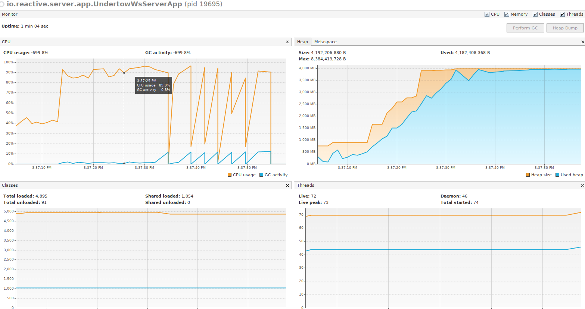
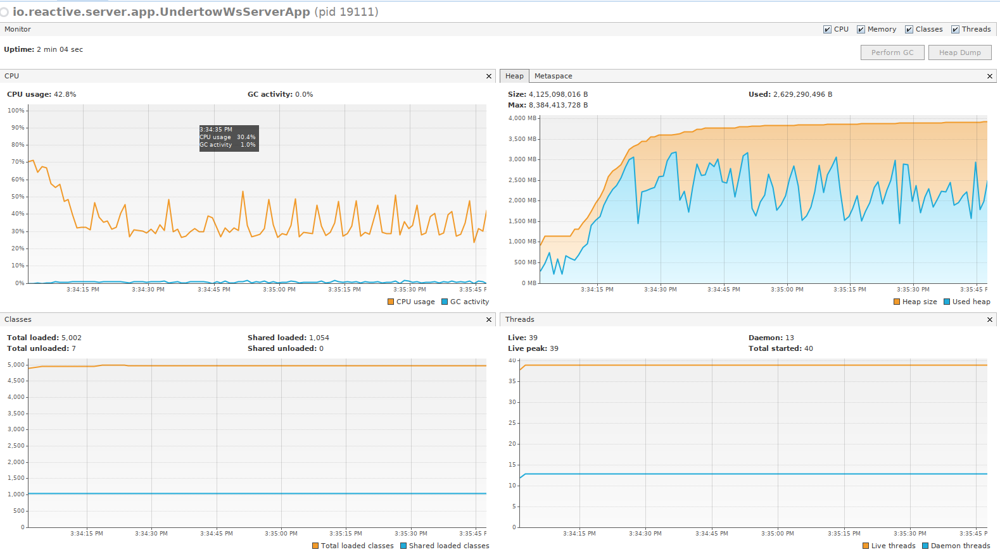

## Reactive WebSocket server ##

This WebSocket server implementation demonstrates two awesome ideas from reactive programming:
1. Using a back-pressure in case of slow client.
2. Applying an actor model to manage a data inside the server.

### Actor model ###

Let's see how it helps to achieve greater throughput. The actor model here is used for sending messages to a client.
MessageSenderImpl class is an actor. It has run() method to execute a real message sending.
If there's messages for sending to a particular client, the Send event is emitted and the actor runner is scheduled.

The actor runner is deadly simple. It's based on concurrent queue (should be replaced with a modern one lock-free impl.)
and a regular executor service (which is actually running an actor task).

### Back-pressure ###

Physically, messages are sending using Undertow transport and WebSocket protocol implementation.
We have async send method with a callback in the specification. Each time a message is sent into the channel, demand will decrease. When demand is zero, no more messages will be sent until demand becomes positive.
Keep in mind that we don't have an actual control how many messages are truly delivered to the client (because of TCP/IP), we operates with some buffer. When the buffer is full, our goal is protecting the application from OOM.

Let's see how does it works. We have some workload under the following conditions:
* Number of clients 1000;
* Sender (in our code) buffer size: max 5000 messages about 250 bytes each;
* Adds 1_500_000 messages per client every second by batches of 5000;
* Emulation of slow clients is 200 milliseconds sleep added on each message read;

If we don't have any back-pressure mechanism, in a short period of time the server will be unresponded and OOM happens eventually.

TCP stat revealed a huge sender queue size:
```
java    19695 sherman 1115u  IPv6 2436306      0t0  TCP localhost:6644->localhost:44348 (ESTABLISHED QR=0 QS=713835)
java    19695 sherman 1116u  IPv6 2435061      0t0  TCP localhost:6644->localhost:44350 (ESTABLISHED QR=0 QS=710065)
java    19695 sherman 1117u  IPv6 2435062      0t0  TCP localhost:6644->localhost:44352 (ESTABLISHED QR=0 QS=725000)
java    19695 sherman 1118u  IPv6 2435063      0t0  TCP localhost:6644->localhost:44354 (ESTABLISHED QR=0 QS=725000)
java    19695 sherman 1119u  IPv6 2435064      0t0  TCP localhost:6644->localhost:44356 (ESTABLISHED QR=0 QS=713545)
java    19695 sherman 1120u  IPv6 2435065      0t0  TCP localhost:6644->localhost:44358 (ESTABLISHED QR=0 QS=724565)
java    19695 sherman 1121u  IPv6 2435066      0t0  TCP localhost:6644->localhost:44360 (ESTABLISHED QR=0 QS=724420)
java    19695 sherman 1122u  IPv6 2435067      0t0  TCP localhost:6644->localhost:44362 (ESTABLISHED QR=0 QS=724420)
java    19695 sherman 1123u  IPv6 2435068      0t0  TCP localhost:6644->localhost:44364 (ESTABLISHED QR=0 QS=710065)
java    19695 sherman 1124u  IPv6 2435069      0t0  TCP localhost:6644->localhost:44366 (ESTABLISHED QR=0 QS=723550)
java    19695 sherman 1125u  IPv6 2435070      0t0  TCP localhost:6644->localhost:44368 (ESTABLISHED QR=0 QS=724710)
java    19695 sherman 1126u  IPv6 2435071      0t0  TCP localhost:6644->localhost:44370 (ESTABLISHED QR=0 QS=725000)
java    19695 sherman 1127u  IPv6 2435072      0t0  TCP localhost:6644->localhost:44372 (ESTABLISHED QR=0 QS=725000)
java    19695 sherman 1128u  IPv6 2438145      0t0  TCP localhost:6644->localhost:44374 (ESTABLISHED QR=0 QS=709920)
java    19695 sherman 1129u  IPv6 2438146      0t0  TCP localhost:6644->localhost:44376 (ESTABLISHED QR=0 QS=712385)
java    19695 sherman 1130u  IPv6 2438147      0t0  TCP localhost:6644->localhost:44378 (ESTABLISHED QR=0 QS=709920)
java    19695 sherman 1131u  IPv6 2438148      0t0  TCP localhost:6644->localhost:44380 (ESTABLISHED QR=0 QS=721665)
java    19695 sherman 1132u  IPv6 2438149      0t0  TCP localhost:6644->localhost:44382 (ESTABLISHED QR=0 QS=725000)
java    19695 sherman 1133u  IPv6 2436317      0t0  TCP localhost:6644->localhost:44384 (ESTABLISHED QR=0 QS=720070)
java    19695 sherman 1134u  IPv6 2436318      0t0  TCP localhost:6644->localhost:44386 (ESTABLISHED QR=0 QS=706005)
```

Now, let's turn on the back-pressure mechanism. Wow! You can see the effect.


Could the back-pressure reduces overall throughput?

In my tests enabling the back-pressure reduces throughput up to 20%.
But keep in mind, I didn't tune a size of maximum messages in flight and buffer sizes of TCP/IP.
So, I'd say, 10-15% of throughput is a good trade off for stability.

### Benchmarking ###

Total messages: 100_000_000.

1000 clients.

#### Settings ####

Intel(R) Core(TM) i7-4770 CPU @ 3.40GHz (Haswell), 4 physical cores.

JDK: 12.0.2 (2019-07-16)

Ubuntu 18.04.3 LTS

Kernel 4.15.0-66

Meltdown/Spectre protection is disabled

```properties
server.max.messages.in.flight=100
server.messages.multiplier=1000000
server.max.messages=5000
server.messages.generator.number=1500000
server.messages.generator.period.seconds=1
server.messages.generator.batches=true
```

#### Results ####

Throughput 1_351_598 msg/sec (avg)
   

  


